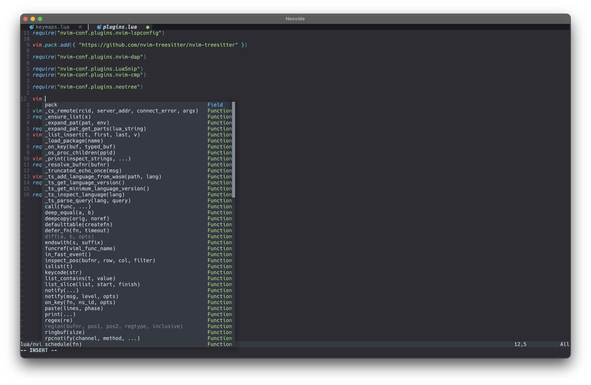
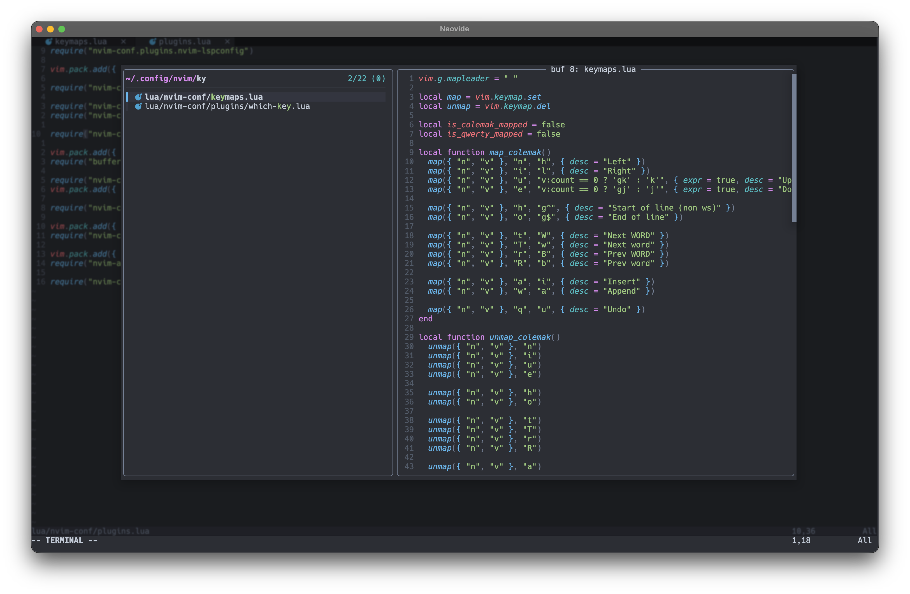
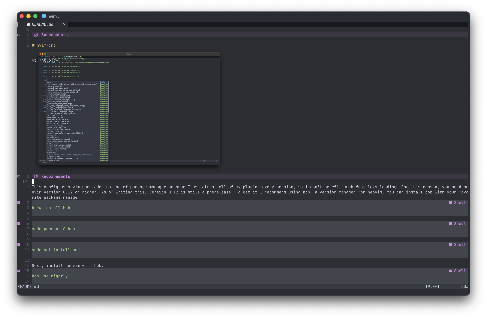

# My Neovim config

## Overview
This repo contains my neovim configuration.
Be aware that it was made for myself only and that you made need to change things to match your needs and desires.

## Features:
- lsps for rust, c / c++, python, java, bash and cmake
- on save formatting with conform.nvim
- syntax highlighting with nvim-treesitter
- fast search with fzf-lua
- many quality of life plugins
- colemak-dh keymaps (you can switch to qwerty by either doing :UseQwerty or changing [init.lua](init.lua))

## Screenshots




## Requirements

This config uses vim.pack.add instead of package manager because I use almost all of my plugins every session, so I don't benefit much from lazy loading. For this reason, you need neovim version 0.12 or higher. As of writing this, version 0.12 is still a prerelease. To get it I recommend using bob, a version manager for neovim. You can install bob with your favorite package manager:
```sh
brew install bob
```

```sh 
sudo pacman -S bob
```

```sh 
sudo apt install bob
```

Next, install neovim with bob.
```sh
bob use nightly
```
If it asks whether to add neovim to your PATH, choose no.
Put 
```sh 
alias nvim="bob run nightly"
```
in .zshrc or .bashrc. If you use neovide, also add
```toml 
neovim-bin = "bob run nightly"
```
to ~/.config/neovide/config.toml (or $XDG_CONFIG_HOME/neovide/config.toml).

## Install

```sh 
mv ~/.config/nvim ~/.config/nvim.bak
git clone https://github.com/ThomasReal/neovim-config ~/.config/nvim
```

## Customisation

### Keymaps 
You can add keymaps to [keymaps.lua](lua/nvim-conf/keymaps.lua). If they are keyboard layout specific, add them to map_<layout>  and also unmap them in unmap_<layout>.
If your primary keyboard layout is qwerty, change 
```lua
require("nvim-conf.keymaps").colemak() 
```
to 
```lua
require("nvim-conf.keymaps").qwerty() 
```
in [init.lua](init.lua)
If you want to switch temporarily, use the vimscript commands :UseQwerty and :UseColemak.

### Plugins
You can add plugins either directly to [plugins.lua](lua/nvim-conf/plugins.lua):
```lua 
vim.pack.add({ "author/your_plugin" })
```
or create lua/nvim-conf/plugins/your_plugin.lua and require it in plugins.lua.

### Colorschemes
You can add functions that enable your preferred colorscheme(s) to the table returned by [colorschemes.lua](lua/nvim-conf/colorschemes.lua) and change
```lua 
require("nvim-conf.colorschemes").edge()
```
to 
```lua 
require("nvim-conf.colorschemes").your_colorscheme()
```
in [init.lua](init.lua)
